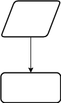

# ЗРАЗОК ОФОРМЛЕННЯ ЛАБОРАТОРНОЇ РОБОТИ
> Оформляти використовуючи Markdown
> 
> Ознайомитися з ним можна [тут](https://www.markdownguide.org/)

# Лабораторна робота № 1
## Тема: Програмування лінійних алгоритмів
### Завдання 1. Розрахувати довжину ( $L$ ) та площу ( $S$ ) кола, об’єм кулі ( $V$ ) із заданим радіусом ( $r$ ). Кожну відповідь навести з точністю до двох знаків після коми.

1. _Постановка задачі._
    
    Дано: r.
    Результат: L; S; V.

1. Побудова математичної моделі.
    
    Математичне формулювання завдання зводиться до обчислення за
    формулами

$$ L = 2\pi r, S = 2\pi r^2, V =\frac{ 4\pi r^3 }{3}. $$

1. Розробка алгоритму розв’язку задачі.

    ```mermaid
      graph TD;
          A-->B;
          A-->C;
          B-->D;
          C-->D;
    ```  
    


1. Розробка програми.
    
    ### Python
    ```python
    # приєднання модуля math стандартної бібліотеки, що містить математичні функції та константи
    import math
    # ініціалізація змінної: введення значення
    дійсного типу з клавіатури
    r = float(input("r = "))
    l = 2 * math.pi * r
    s = math.pi * math.pow(r, 2)
    v = 4/3 * math.pi * math.pow(r, 3)
    print("l = ", round(l, 2)) # виведення значення змінної
    із заокругленням до двох знаків після коми
    print("s = ", round(s, 2))
    print("v = ", round(v, 2))
    ```
    ### JS
    ```js
    var r, s, l, v; // оголошення змінних
    // присвоєння змінній значення числового
    типу, введеного з клавіатури
    r = Number(prompt('r = ', ""));
    l = 2 * Math.PI * r;
    s = Math.PI * r * r;
    v = 4/3 * Math.PI * Math.pow(r, 3);
    console.log("l = " + l.toFixed(2)); // виведення значення
    змінної із заокругленням до двох знаків після коми
    console.log("s = " + s.toFixed(2));
    console.log("v = " + v.toFixed(2));
    ```
1. _Результат_
    
    ### Python
    ```console
     sh -c make -s
     ./main
    Введіть радіус!
        > 3.5
    L = 21.99
    S = 76.97
    V = 179.59
     

    ```
    
    
